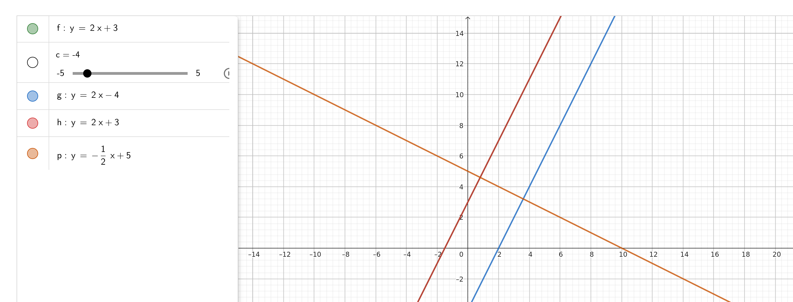
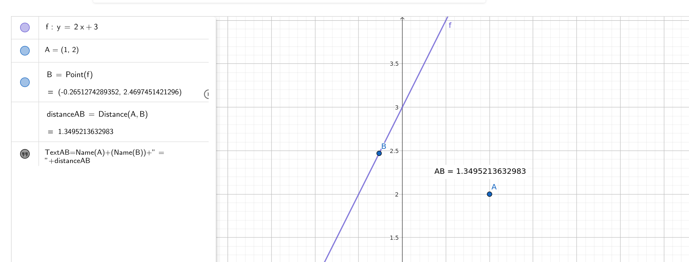

## Q1

### Given Line:
$$y = 2x + 3$$

### **Parallel Line:**

The slope (\(m\)) of the original line is 2. A parallel line will have the same slope:

$$y = mx + B \quad \text{where} \quad m = 2$$

We chose the same slope, so:

$$y = 2x - 4$$

### **Perpendicular Line:**

The slope of a perpendicular line is the **negative reciprocal** of 2:

$$ \text{Slope} = -\frac{1}{2} $$
The equation of the perpendicular line is:
$$ y = -\frac{1}{2}x + 5 $$

---

## Q2

### Given Line and Point:
- Line: $$y = 2x + 3$$
- Point: $$A(1, 2)$$

### **Find Distance from Point \(A\) to the Line:**
The formula for the distance (\(d\)) from a point \((x_1, y_1)\) to a line \(Ax + By + C = 0\) is:
$$d = \frac{|Ax_1 + By_1 + C|}{\sqrt{A^2 + B^2}}$$

### **Convert Line to Standard Form:**
The line \( y = 2x + 3 \) can be written as:
$$2x - y + 3 = 0$$
Here:
- \( A = 2 \)
- \( B = -1 \)
- \( C = 3 \)

### **Substitute Values:**
For point \( A(1, 2) \):
$$d = \frac{|2(1) - 1(2) + 3|}{\sqrt{2^2 + (-1)^2}} = \frac{|2 - 2 + 3|}{\sqrt{4 + 1}}$$
$$d = \frac{3}{\sqrt{5}} \approx 1.34$$

