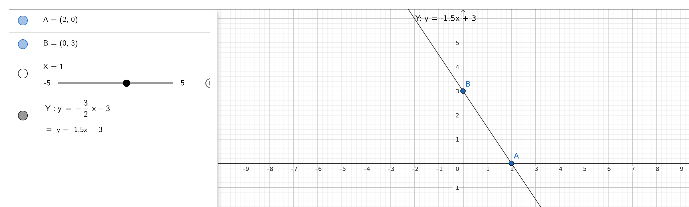

## Q1

### Given Line:
$$y = 2x + 3$$

### **Parallel Line:**

The slope (\(m\)) of the original line is 2. A parallel line will have the same slope:

$$y = mx + B \quad \text{where} \quad m = 2$$

We chose the same slope, so:

$$y = 2x - 4$$

### **Perpendicular Line:**

The slope of a perpendicular line is the **negative reciprocal** of 2:

$$ \text{Slope} = -\frac{1}{2} $$
The equation of the perpendicular line is:
$$ y = -\frac{1}{2}x + 5 $$

---

## Q2

### Given Line and Point:
- Line: $$y = 2x + 3$$
- Point: $$A(1, 2)$$

### **Find Distance from Point \(A\) to the Line:**
The formula for the distance (\(d\)) from a point \((x_1, y_1)\) to a line \(Ax + By + C = 0\) is:
$$d = \frac{|Ax_1 + By_1 + C|}{\sqrt{A^2 + B^2}}$$

### **Convert Line to Standard Form:**

The line \( y = 2x + 3 \) can be written as:
$$2x - y + 3 = 0$$
Here:
- \( A = 2 \)
- \( B = -1 \)
- \( C = 3 \)

### **Substitute Values:**
For point \( A(1, 2) \):
$$d = \frac{|2(1) - 1(2) + 3|}{\sqrt{2^2 + (-1)^2}} = \frac{|2 - 2 + 3|}{\sqrt{4 + 1}}$$
$$d = \frac{3}{\sqrt{5}} \approx 1.34$$

## Q3

### Given Points:
- \( A(2, 0) \)
- \( B(0, 3) \)

### **Find the Equation of the Line:**

#### **Step 1: Find the Slope (\(m\)):**
The slope (\(m\)) between two points \((x_1, y_1)\) and \((x_2, y_2)\) is given by:
$$m = \frac{y_2 - y_1}{x_2 - x_1}$$

For points \(A(2, 0)\) and \(B(0, 3)\):
$$m = \frac{3 - 0}{0 - 2} = -\frac{3}{2}$$

#### **Step 2: Point-Slope Form:**
The point-slope form of a line is:
$$y - y_1 = m(x - x_1)$$

Using point \(B(0, 3)\):
$$y - 3 = -\frac{3}{2}(x - 0)$$

#### **Final Equation:**
$$y = -\frac{3}{2}x + 3$$

---

## Q4

### **Angle Between the Line \(y = x + 3\) and the \(x\)-Axis:**

#### **Slope (\(m\)) of the Line:**
The slope of the line \( y = x + 3 \) is 1.

#### **Angle Formula:**
The angle (\(\theta\)) between a line and the \(x\)-axis is given by:
$$\theta = \tan^{-1}(m)$$

For \(m = 1\):
$$\theta = \tan^{-1}(1) = 45^\circ$$

---

## Q5

### **Vector Perpendicular to the Line \( x + y + 1 = 0 \):**

The equation of the line is:
$$x + y + 1 = 0$$

#### **Normal Vector:**
A perpendicular vector to a line \(Ax + By + C = 0\) is given by:
$$\vec{v} = (A, B)$$

For the line \(x + y + 1 = 0\):
$$\vec{v} = (1, 1)$$

