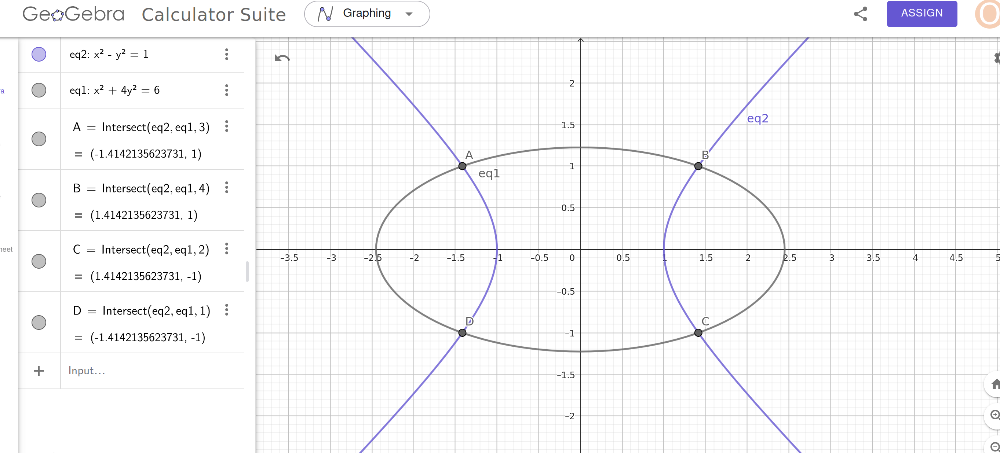

# Finding the Intersection Points of the Hyperbola and Ellipse

We are tasked with finding the intersection points of the hyperbola \(x^2 - y^2 = 1\) and the ellipse \(x^2 + 4y^2 = 6\).

---

### **Step 1: System of Equations**
We are given two equations:
1. \(x^2 - y^2 = 1 \tag{1}\)
2. \(x^2 + 4y^2 = 6 \tag{2}\)

---

### **Step 2: Eliminate \(x^2\) by Solving for \(x^2\) in Terms of \(y^2\):**

From equation (1):
\[
x^2 = y^2 + 1 \tag{3}.
\]

Substitute \(x^2 = y^2 + 1\) into equation (2):
\[
(y^2 + 1) + 4y^2 = 6.
\]

---

### **Step 3: Solve for \(y^2\):**
Simplify the equation:
\[
y^2 + 1 + 4y^2 = 6
\]
\[
5y^2 + 1 = 6
\]
\[
5y^2 = 5 \implies y^2 = 1.
\]

---

### **Step 4: Solve for \(x^2\):**

Substitute \(y^2 = 1\) into equation (3):
\[
x^2 = 1 + 1 = 2.
\]

---

### **Step 5: Find \(x\) and \(y\):**

- If \(x^2 = 2\), then \(x = \pm \sqrt{2}\).
- If \(y^2 = 1\), then \(y = \pm 1\).

---

### **Step 6: Intersection Points**

Combine \(x = \pm \sqrt{2}\) and \(y = \pm 1\). The intersection points are:
\[
(\sqrt{2}, 1), \quad (\sqrt{2}, -1), \quad (-\sqrt{2}, 1), \quad (-\sqrt{2}, -1).
\]

