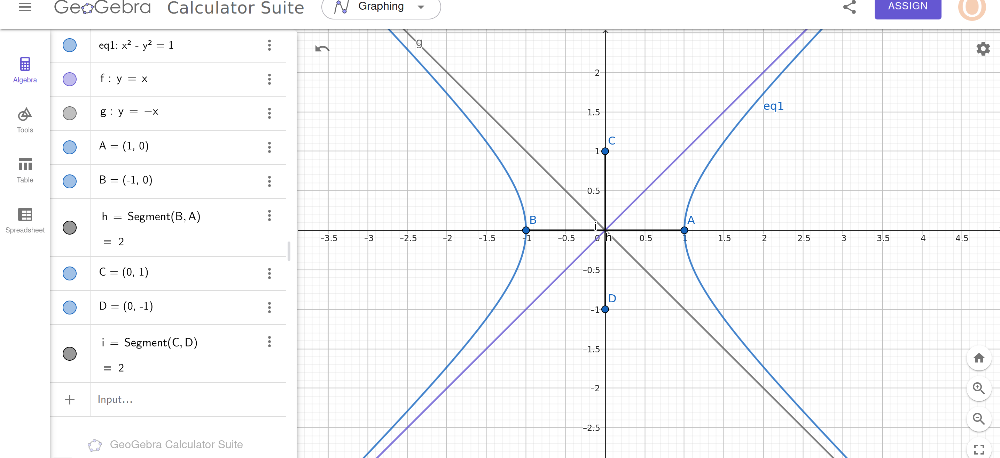

# Solution to the System of Equations

## Step 1: System of Equations
$$x^2 - y^2 = 1 \tag{1}$$  
$$x^2 + 4y^2 = 6 \tag{2}$$

## Step 2: Eliminate \(x^2\) by solving for \(x^2\) in terms of \(y^2\):
From equation (1):  
$$x^2 = y^2 + 1 \tag{3}$$  

Substitute \(x^2 = y^2 + 1\) into equation (2):  
$$(y^2 + 1) + 4y^2 = 6$$  

## Step 3: Solve for \(y^2\):  
Simplify the equation:  
$$y^2 + 1 + 4y^2 = 6$$  
$$5y^2 + 1 = 6$$  
$$5y^2 = 5 \implies y^2 = 1$$  

## Step 4: Solve for \(x^2\):  
Substitute \(y^2 = 1\) into equation (3):  
$$x^2 = 1 + 1 = 2$$  

## Step 5: Find \(x\) and \(y\):  
If \(x^2 = 2\), then:  
$$x = \pm \sqrt{2}$$  

If \(y^2 = 1\), then:  
$$y = \pm 1$$  

## Step 6: Intersection Points:  
Combine \(x = \pm \sqrt{2}\) and \(y = \pm 1\). The intersection points are:  
$$(\sqrt{2}, 1), (\sqrt{2}, -1), (-\sqrt{2}, 1), (-\sqrt{2}, -1)$$  

# Notes on the Hyperbola

The general equation of the hyperbola is:  
$$\frac{x^2}{a^2} - \frac{y^2}{b^2} = 1.$$

For the given hyperbola \(x^2 - y^2 = 1\), we can rewrite it as:  
$$\frac{x^2}{1} - \frac{y^2}{1} = 1,$$  
or equivalently:  
$$\frac{1}{x^2} - \frac{1}{y^2} = 1.$$

Here:  
- \(a^2 = 1 \implies a = 1\)  
- \(b^2 = 1 \implies b = 1\)

### Distance Between Branches

The distance between the two branches of a hyperbola is the distance between its asymptotes at a specific point. For the standard hyperbola  
$$\frac{x^2}{a^2} - \frac{y^2}{b^2} = 1,$$  
where the transverse axis lies along the \(x\)-axis, the distance between the branches is:  
$$2b,$$  
and since \(b = 1\):  
$$\text{Distance between branches} = 2b = 2 \cdot 1 = 2.$$  

Thus:  
$$\text{Distance between branches} = 2.$$

