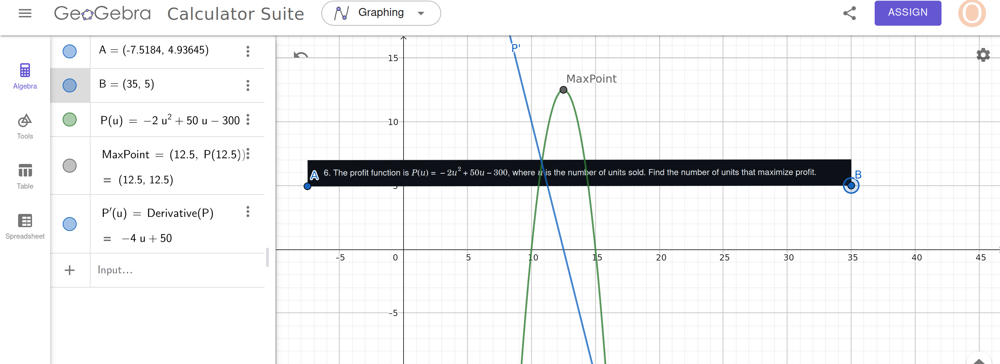
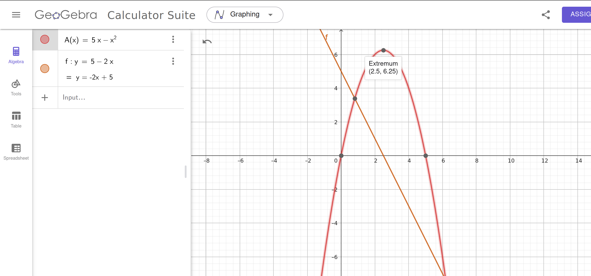
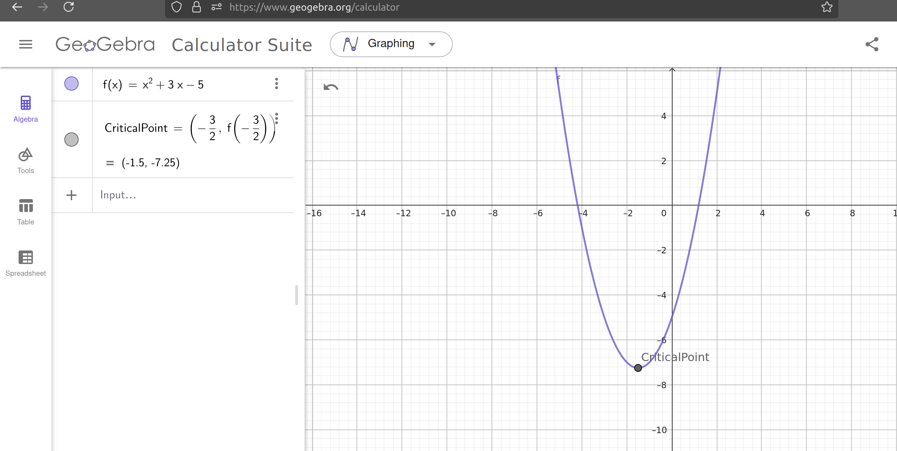

## Solution

The position of the particle is given by:
$$x(t) = 3t^2 - 6t + 1$$

### 1. Velocity \( V(t) = x'(t) \)

To find the velocity, differentiate \( x(t) \):
$$V(t) = x'(t) = \frac{d}{dt}[3t^2 - 6t + 1]$$
$$V(t) = 6t - 6$$

---

### 2. Acceleration \( a(t) = x''(t) \)

To find the acceleration, differentiate \( V(t) \):
$$a(t) = V'(t) = \frac{d}{dt}[6t - 6]$$
$$a(t) = 6$$

---

1. **Velocity** at \( t = 2 \):
$$V(2) = 6(2) - 6$$
$$V(2) = 12 - 6 = 6$$

1. **Acceleration** at \( t = 2 \):
$$a(2) = 6$$

---

### Final Results:

- Velocity at \( t = 2 \):
  $$V(2) = 6$$

- Acceleration at \( t = 2 \):
  $$a(2) = 6$$

## Problem 6:
The profit function is given by:

$$ P(u) = -2u^2 + 50u - 300 $$

where \( u \) is the number of units sold. We need to find the number of units that maximize profit.

### Solution:

1. Find the derivative of \( P(u) \):
   $$ P'(u) = -4u + 50 $$

2. Set \( P'(u) = 0 \) to find the critical points:
   $$ -4u + 50 = 0 \quad \Rightarrow \quad u = \frac{50}{4} = 12.5 $$

### Final Answer:
The number of units that maximize profit is:
$$ u = 12.5 \text{ units.} $$

---

## Problem 7:
You have 10 meters of string, and you need to enclose the largest possible rectangular area. Find the dimensions of the rectangle.

### Solution:

1. Let the dimensions of the rectangle be \( x \) (length) and \( y \) (width). The perimeter constraint is:
   $$2x + 2y = 10 \quad \Rightarrow \quad x + y = 5 \quad \Rightarrow \quad y = 5 - x $$

2. The area \( A \) of the rectangle is:
   $$ A = x \cdot y = x(5 - x) = 5x - x^2 $$

3. To maximize the area, find the derivative of \( A \) and set it to zero:
   $$ A'(x) = 5 - 2x  $$
  $$  A'(x) = 0 \quad \Rightarrow \quad 5 - 2x = 0 \quad \Rightarrow \quad x = \frac{5}{2} = 2.5  $$

4. Solve for \( y \):
   $$  y = 5 - x = 5 - 2.5 = 2.5  $$

### Final Answer:
The dimensions of the rectangle are:
$$ 2.5 \, \text{meters by} \, 2.5 \, \text{meters.} $$

---

## Problem 8:
Find the extremum of:
$$ f(x) = x^2 + 3x - 5 $$

### Solution:

1. Find the derivative of \( f(x) \):
   $$ f'(x) = 2x + 3 $$

2. Set \( f'(x) = 0 \) to find critical points:
   $$ 2x + 3 = 0 \quad \Rightarrow \quad x = -\frac{3}{2} $$

3. Verify the nature of the extremum using the second derivative:
   $$ f''(x) = 2  $$
   Since \( f''(x) > 0 \), the function has a **minimum** at \( x = -\frac{3}{2} \).

4. Find the minimum value by substituting \( x = -\frac{3}{2} \) into \( f(x) \):
   $$f\left(-\frac{3}{2}\right) = \left(-\frac{3}{2}\right)^2 + 3\left(-\frac{3}{2}\right) - 5$$
   $$= \frac{9}{4} - \frac{9}{2} - 5 = \frac{9}{4} - \frac{18}{4} - \frac{20}{4} = \frac{-29}{4}$$

### Final Answer:
The minimum value of \( f(x) \) is:
$$ \frac{-29}{4} \, \text{at} \, x = -\frac{3}{2}. $$

---

## Problem 9:
Find the extremum of:
$$ f(x) = \frac{x^2 + 2x + 1}{x - 1} $$

### Solution:

1. Simplify the function:
   $$  f(x) = \frac{(x + 1)^2}{x - 1}  $$

2. Find the derivative using the quotient rule:
   The quotient rule states:
   $$ \left(\frac{g(x)}{h(x)}\right)' = \frac{g'(x)h(x) - g(x)h'(x)}{[h(x)]^2}$$
   Here, \( g(x) = (x + 1)^2 \) and \( h(x) = x - 1 \). Compute \( g'(x) \) and \( h'(x) \):
   $$ g'(x) = 2(x + 1), \quad h'(x) = 1  $$
   So:
   $$ f'(x) = \frac{2(x + 1)(x - 1) - (x + 1)^2}{(x - 1)^2} $$

3. Simplify the numerator:
   $$ 2(x + 1)(x - 1) - (x + 1)^2 = 2(x^2 - 1) - (x^2 + 2x + 1) $$
   $$  = 2x^2 - 2 - x^2 - 2x - 1 = x^2 - 2x - 3  $$
   So:
   $$  f'(x) = \frac{x^2 - 2x - 3}{(x - 1)^2}  $$

4. Set \( f'(x) = 0 \):
   The numerator must be zero:
   $$ x^2 - 2x - 3 = 0 $$
   Factorize:
   $$  (x - 3)(x + 1) = 0 \quad \Rightarrow \quad x = 3 \, \text{or} \, x = -1  $$

5. Verify the nature of the critical points:
   Use a sign chart or second derivative test (details omitted for brevity).

### Final Answer:
The extremum occurs at:
$$ x = 3 \, \text{and} \, x = -1. $$