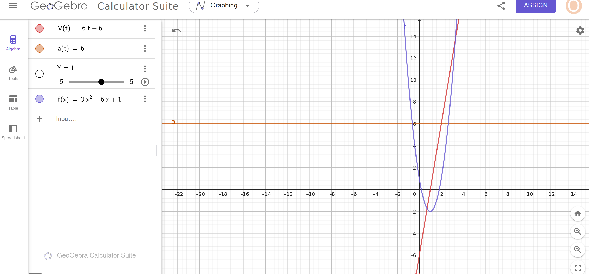

## Solution

The position of the particle is given by:
$$x(t) = 3t^2 - 6t + 1$$

### 1. Velocity \( V(t) = x'(t) \)

To find the velocity, differentiate \( x(t) \):
$$V(t) = x'(t) = \frac{d}{dt}[3t^2 - 6t + 1]$$
$$V(t) = 6t - 6$$

---

### 2. Acceleration \( a(t) = x''(t) \)

To find the acceleration, differentiate \( V(t) \):
$$a(t) = V'(t) = \frac{d}{dt}[6t - 6]$$
$$a(t) = 6$$

---

1. **Velocity** at \( t = 2 \):
$$V(2) = 6(2) - 6$$
$$V(2) = 12 - 6 = 6$$

1. **Acceleration** at \( t = 2 \):
$$a(2) = 6$$

---

### Final Results:

- Velocity at \( t = 2 \):
  $$V(2) = 6$$

- Acceleration at \( t = 2 \):
  $$a(2) = 6$$

## Problem 6:
The profit function is given by:

$$ P(u) = -2u^2 + 50u - 300 $$

where \( u \) is the number of units sold. We need to find the number of units that maximize profit.

### Solution:

1. Find the derivative of \( P(u) \):
   $$ P'(u) = -4u + 50 $$

2. Set \( P'(u) = 0 \) to find the critical points:
   $$ -4u + 50 = 0 \quad \Rightarrow \quad u = \frac{50}{4} = 12.5 $$

### Final Answer:
The number of units that maximize profit is:
$$ u = 12.5 \text{ units.} $$

---

## Problem 7:
You have 10 meters of string, and you need to enclose the largest possible rectangular area. Find the dimensions of the rectangle.

### Solution:

1. Let the dimensions of the rectangle be \( x \) (length) and \( y \) (width). The perimeter constraint is:
   $$2x + 2y = 10 \quad \Rightarrow \quad x + y = 5 \quad \Rightarrow \quad y = 5 - x $$

2. The area \( A \) of the rectangle is:
   $$ A = x \cdot y = x(5 - x) = 5x - x^2 $$

3. To maximize the area, find the derivative of \( A \) and set it to zero:
   $$ A'(x) = 5 - 2x  $$
  $$  A'(x) = 0 \quad \Rightarrow \quad 5 - 2x = 0 \quad \Rightarrow \quad x = \frac{5}{2} = 2.5  $$

4. Solve for \( y \):
   $$  y = 5 - x = 5 - 2.5 = 2.5  $$

### Final Answer:
The dimensions of the rectangle are:
$$ 2.5 \, \text{meters by} \, 2.5 \, \text{meters.} $$

---

## Problem 8:
Find the extremum of:
$$ f(x) = x^2 + 3x - 5 $$

### Solution:

1. Find the derivative of \( f(x) \):
   $$ f'(x) = 2x + 3 $$

2. Set \( f'(x) = 0 \) to find critical points:
   $$ 2x + 3 = 0 \quad \Rightarrow \quad x = -\frac{3}{2} $$

3. Verify the nature of the extremum using the second derivative:
   $$ f''(x) = 2  $$
   Since \( f''(x) > 0 \), the function has a **minimum** at \( x = -\frac{3}{2} \).

4. Find the minimum value by substituting \( x = -\frac{3}{2} \) into \( f(x) \):
   $$f\left(-\frac{3}{2}\right) = \left(-\frac{3}{2}\right)^2 + 3\left(-\frac{3}{2}\right) - 5$$
   $$= \frac{9}{4} - \frac{9}{2} - 5 = \frac{9}{4} - \frac{18}{4} - \frac{20}{4} = \frac{-29}{4}$$

### Final Answer:
The minimum value of \( f(x) \) is:
$$ \frac{-29}{4} \, \text{at} \, x = -\frac{3}{2}. $$

---

## Problem 9:
Find the extremum of:
$$ f(x) = \frac{x^2 + 2x + 1}{x - 1} $$

### Solution:

1. Simplify the function:
   $$  f(x) = \frac{(x + 1)^2}{x - 1}  $$

2. Find the derivative using the quotient rule:
   The quotient rule states:
   $$ \left(\frac{g(x)}{h(x)}\right)' = \frac{g'(x)h(x) - g(x)h'(x)}{[h(x)]^2}$$
   Here, \( g(x) = (x + 1)^2 \) and \( h(x) = x - 1 \). Compute \( g'(x) \) and \( h'(x) \):
   $$ g'(x) = 2(x + 1), \quad h'(x) = 1  $$
   So:
   $$ f'(x) = \frac{2(x + 1)(x - 1) - (x + 1)^2}{(x - 1)^2} $$

3. Simplify the numerator:
   $$ 2(x + 1)(x - 1) - (x + 1)^2 = 2(x^2 - 1) - (x^2 + 2x + 1) $$
   $$  = 2x^2 - 2 - x^2 - 2x - 1 = x^2 - 2x - 3  $$
   So:
   $$  f'(x) = \frac{x^2 - 2x - 3}{(x - 1)^2}  $$

4. Set \( f'(x) = 0 \):
   The numerator must be zero:
   $$ x^2 - 2x - 3 = 0 $$
   Factorize:
   $$  (x - 3)(x + 1) = 0 \quad \Rightarrow \quad x = 3 \, \text{or} \, x = -1  $$

5. Verify the nature of the critical points:
   Use a sign chart or second derivative test (details omitted for brevity).

### Final Answer:
The extremum occurs at:
$$ x = 3 \, \text{and} \, x = -1. $$

integral 
# Solutions to Integrals

### 1. \( \int 1 \, dx \)
**Solution:**
$$ \int 1 \, dx = x + C $$  
**Answer:**
$$ x + C $$

---

### 2. \( \int (x^2 + 2) \, dx \)
**Solution:**
$$ \int (x^2 + 2) \, dx = \int x^2 \, dx + \int 2 \, dx $$  
Using the power rule \( \int x^n \, dx = \frac{x^{n+1}}{n+1} \):  
$$ \int x^2 \, dx = \frac{x^3}{3}, \quad \int 2 \, dx = 2x $$  
Adding the results:  
$$ \frac{x^3}{3} + 2x + C $$  
**Answer:**
$$ \frac{x^3}{3} + 2x + C $$

---

### 3. \( \int 2 \sin(x) \, dx \)
**Solution:**
The integral of \( \sin(x) \) is \( -\cos(x) \):  
$$ \int 2 \sin(x) \, dx = -2 \cos(x) + C $$  
**Answer:**
$$ -2 \cos(x) + C $$

---

### 4. \( \int \frac{3}{x} \, dx \)
**Solution:**
The integral of \( \frac{1}{x} \) is \( \ln|x| \):  
$$ \int \frac{3}{x} \, dx = 3 \ln|x| + C $$  
**Answer:**
$$ 3 \ln|x| + C $$

---

### 5. \( \int \frac{1}{2} \, dx \)
**Solution:**
The constant \( \frac{1}{2} \) is treated as a coefficient:  
$$ \int \frac{1}{2} \, dx = \frac{1}{2}x + C $$  
**Answer:**
$$ \frac{1}{2}x + C $$

---

### 6. \( \int \left( \frac{1}{3}x^4 - 5 \right) \, dx \)
**Solution:**
Split the integral:  
$$ \int \left( \frac{1}{3}x^4 - 5 \right) \, dx = \int \frac{1}{3}x^4 \, dx - \int 5 \, dx $$  
Using the power rule:  
$$ \int \frac{1}{3}x^4 \, dx = \frac{1}{15}x^5, \quad \int 5 \, dx = 5x $$  
Adding the results:  
$$ \frac{1}{15}x^5 - 5x + C $$  
**Answer:**
$$ \frac{1}{15}x^5 - 5x + C $$

---

### 7. \( \int (\sin^2(x) + \cos^2(x)) \, dx \)
**Solution:**
Using the trigonometric identity \( \sin^2(x) + \cos^2(x) = 1 \):  
$$ \int (\sin^2(x) + \cos^2(x)) \, dx = \int 1 \, dx = x + C $$  
**Answer:**
$$ x + C $$

---

### 8. \( \int (5 \sin(x) + 3e^x) \, dx \)
**Solution:**
Split the integral:  
$$ \int (5 \sin(x) + 3e^x) \, dx = \int 5 \sin(x) \, dx + \int 3e^x \, dx $$  
The integral of \( \sin(x) \) is \( -\cos(x) \), and \( e^x \) remains \( e^x \):  
$$ \int 5 \sin(x) \, dx = -5 \cos(x), \quad \int 3e^x \, dx = 3e^x $$  
Adding the results:  
$$ -5 \cos(x) + 3e^x + C $$  
**Answer:**
$$ -5 \cos(x) + 3e^x + C $$

---

### 9. \( \int \sqrt[3]{x} \, dx \)
**Solution:**
Rewrite \( \sqrt[3]{x} \) as \( x^{\frac{1}{3}} \) and use the power rule:  
$$ \int x^{\frac{1}{3}} \, dx = \frac{x^{\frac{1}{3} + 1}}{\frac{1}{3} + 1} = \frac{x^{\frac{4}{3}}}{\frac{4}{3}} = \frac{3}{4}x^{\frac{4}{3}} $$  
**Answer:**
$$ \frac{3}{4}x^{\frac{4}{3}} + C $$

---

### 10. \( \int \sqrt{10x} \, dx \)
**Solution:**
Rewrite \( \sqrt{10x} \) as \( (10x)^{\frac{1}{2}} \):  
$$ \int \sqrt{10x} \, dx = \int (10x)^{\frac{1}{2}} \, dx $$  
Use substitution: let \( u = 10x, \, du = 10 \, dx \):  
$$ \int u^{\frac{1}{2}} \frac{1}{10} \, du = \frac{1}{10} \cdot \frac{u^{\frac{3}{2}}}{\frac{3}{2}} = \frac{1}{15}u^{\frac{3}{2}} $$  
Substitute back \( u = 10x \):  
$$ \frac{1}{15}(10x)^{\frac{3}{2}} $$  
**Answer:**
$$ \frac{1}{15}(10x)^{\frac{3}{2}} + C $$

---

### 11. \( \int \cos\left(\frac{5}{2}x + 3\right) \, dx \)
**Solution:**
Using the formula \( \int \cos(ax+b) \, dx = \frac{1}{a} \sin(ax+b) \):  
$$ \int \cos\left(\frac{5}{2}x + 3\right) \, dx = \frac{1}{\frac{5}{2}} \sin\left(\frac{5}{2}x + 3\right) = \frac{2}{5} \sin\left(\frac{5}{2}x + 3\right) + C $$  
**Answer:**
$$ \frac{2}{5} \sin\left(\frac{5}{2}x + 3\right) + C $$

---

### 12. \( \int \frac{\cos(\ln(x))}{x} \, dx \)
**Solution:**
Using substitution: let \( u = \ln(x), \, du = \frac{1}{x} dx \):  
$$ \int \frac{\cos(\ln(x))}{x} \, dx = \int \cos(u) \, du = \sin(u) + C $$  
Substitute back \( u = \ln(x) \):  
$$ \sin(\ln(x)) + C $$  
**Answer:**
$$ \sin(\ln(x)) + C $$

---

### 13. \( \int x \ln(x) \, dx \)
**Solution:**
Using integration by parts: let \( u = \ln(x), \, dv = x \, dx \):  
$$ u = \ln(x), \, du = \frac{1}{x} dx, \, v = \frac{x^2}{2} $$  
Integration by parts formula:  
$$ \int x \ln(x) \, dx = uv - \int v \, du = \frac{x^2}{2} \ln(x) - \int \frac{x^2}{2} \cdot \frac{1}{x} dx $$  
Simplify:  
$$ \int x \ln(x) \, dx = \frac{x^2}{2} \ln(x) - \frac{x^2}{4} + C $$  
**Answer:**
$$ \frac{x^2}{2} \ln(x) - \frac{x^2}{4} + C $$

---

### 14. \( \int xe^x \, dx \)
**Solution:**
Using integration by parts: let \( u = x, \, dv = e^x dx \):  
$$ u = x, \, du = dx, \, v = e^x $$  
Integration by parts formula:  
$$ \int xe^x \, dx = uv - \int v \, du = xe^x - \int e^x dx $$  
Simplify:  
$$ \int xe^x \, dx = xe^x - e^x + C $$  
**Answer:**
$$ xe^x - e^x + C $$

---
